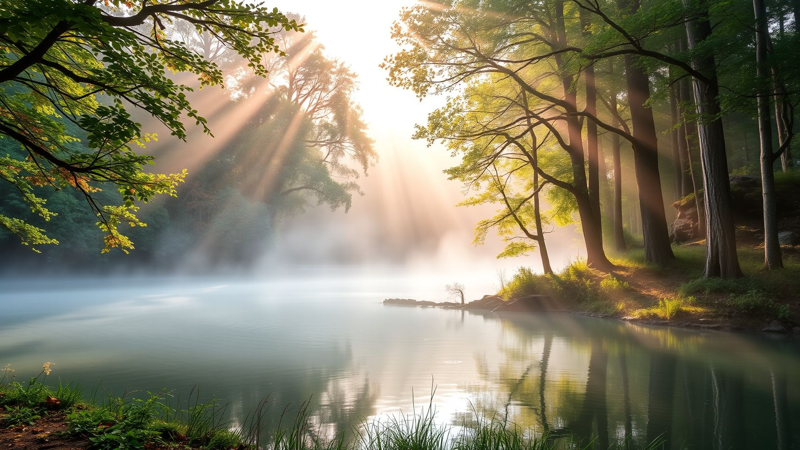
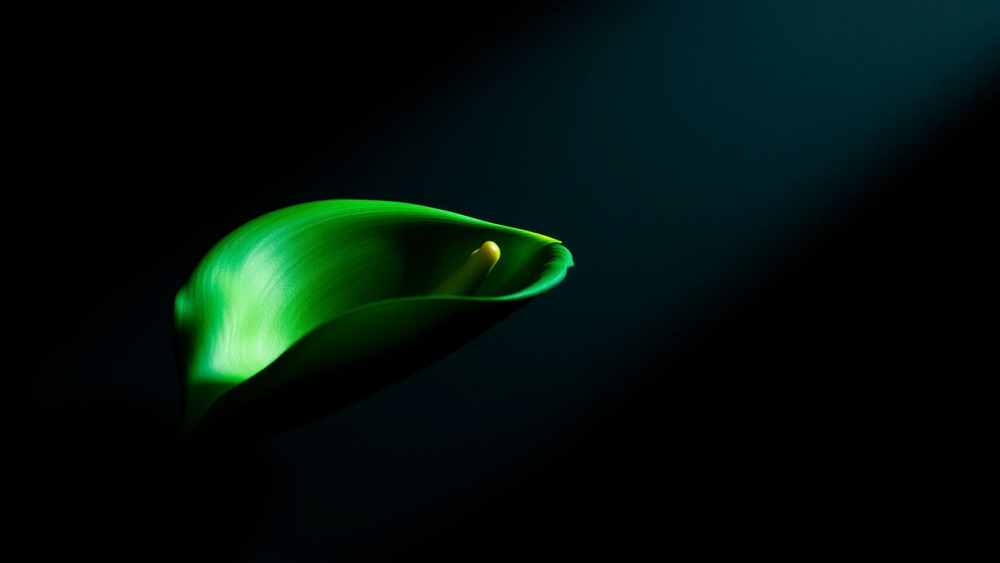

# TranquilAI - Serene AI Wallpaper Generator

A powerful Python script that generates tranquil AI wallpapers using Google Gemini 2.5 Pro for prompt enhancement and Pollinations (Flux) for 100% free wallpaper image generation, further applying advanced AI post-processing effects to produce serene, beautiful masterpieces.

- Changes the wallpaper daily with peaceful, stunning imagery
- I recommend upscaling the result with Upscayl (16x, Double Upscale) as Pollinations is limited to a certain resolution.
- Do I recommend this tool? I do not recommend this tool if you are a wallpaper purist, AI generally creates low-quality, bad artistic style content, additionally unless you pay extremely high-costs, getting higher-resolution AI is difficult and it often has to be paired with an upscaler to look right, I'd recommend this tool to help you generate and view wallpapers before upscaling them and adding them to a proper wallpaper pack you are building, this should only be used as a preview tool if you want super-high-quality images. AI is generally low-quality and I recommend Wallhaven and Alphacoders Wallpaper Abyss instead.
- The issue with AI is that it often looks high-quality at a low size but when it is set at a wallpaper you start to notice the inherent flaws.

- Inspired by the macos-gen-ai-wallpaper repo and created by CY83R-3X71NC710N

## ✨ Example Output

Here are examples of the stunning wallpapers this generator creates:


*Generated from prompt: "serene forest lake" - Enhanced by Gemini 2.5 Pro into a detailed, cinematic description*




These breathtaking 5K wallpapers showcase the tranquil quality you can expect for the low price of free, featuring:
- **Photorealistic detail** with morning mist and golden sunlight
- **Perfect composition** with glass-like water reflections  
- **Professional lighting** creating depth and atmosphere
- **5120x2880 resolution** for crisp display on any screen
- **Advanced post-processing** with noise reduction, HDR effects, and quality optimization

## Features

- **Single Script**: All functionality consolidated into one Python file
- **Intelligent Prompt Enhancement**: Uses Google Gemini 2.5 Pro to enhance prompts for better AI-generated wallpapers
- **High-Quality Image Generation**: Uses Pollinations AI with the Flux model for stunning wallpapers
- **Advanced Post-Processing**: Automatic image enhancement with noise reduction, HDR effects, gamma correction, edge enhancement, and quality optimization
- **Multiple Wallpaper Tools**: Supports wallpaper-cli, m-cli, and AppleScript for setting wallpapers
- **Multi-Display Support**: Automatically detects and generates wallpapers for multiple displays
- **5K Resolution**: Generates up to 5120x2880 resolution for maximum quality on macOS displays
- **Backup & Queue**: Saves copies and queues images with timestamps
- **Private Mode**: Option to skip prompt enhancement and use minimal parameters
- **Easy Setup**: One-command dependency installation

## Quick Start

### 1. Setup (One-time)

**Option A: Easy Setup (Recommended)**
```bash
./setup-easy.sh
```

**Option B: Manual Setup**
```bash
# Install dependencies
python3 wallpaper_generator.py --setup
```

### 2. Setup Google Gemini API (Optional but Recommended)

For enhanced prompts that generate better wallpapers:

1. **Get API Key**: Visit [Google AI Studio](https://aistudio.google.com/apikey) to get your free API key
2. **Create .env file**:
   ```bash
   echo "GOOGLE_API_KEY=your_actual_api_key_here" > .env
   ```

### 3. Generate and Set Wallpapers

**Basic Usage (with Gemini enhancement)**:
```bash
python3 wallpaper_generator.py "a serene mountain landscape at sunset"
```

**Private Mode (no prompt enhancement)**:
```bash
python3 wallpaper_generator.py "a serene mountain landscape at sunset" --private
```

**Using the convenient wrapper**:
```bash
./generate-wallpaper "a serene mountain landscape at sunset"
```

### 4. Advanced Usage

#### Custom Resolution
```bash
python3 wallpaper_generator.py "cyberpunk city neon lights" --resolution 2560x1440
```

#### Save Copies to Custom Directory
```bash
python3 wallpaper_generator.py "abstract art colorful" --save-dir ~/Pictures/AI-Wallpapers
```

#### Generate Only (Don't Set as Wallpaper)
```bash
python3 wallpaper_generator.py "ocean waves" --generate-only
```

#### Specific Wallpaper Tool
```bash
python3 wallpaper_generator.py "forest path" --tool applescript
```

#### Multiple Displays
```bash
python3 wallpaper_generator.py "space nebula" --displays 3
```

## How It Works

1. **Prompt Enhancement**: If a Google API key is available and not in private mode, Gemini 2.5 Pro enhances your prompt with detailed visual descriptions
2. **Display Detection**: Automatically detects the number of connected displays
3. **Image Generation**: Uses Pollinations AI with enhanced prompts to generate high-quality images (default 5K resolution)
4. **Queue System**: Saves images to a queue directory with unique timestamped filenames
5. **Wallpaper Setting**: Uses the best available tool to set wallpapers per display
6. **Desktop Refresh**: Refreshes the desktop to apply changes

## Wallpaper Setting Methods

The script tries multiple methods to set wallpapers (in order of preference):

1. **wallpaper-cli** - Cross-platform Node.js tool
2. **m-cli** - macOS-specific Homebrew tool  
3. **AppleScript** - Built-in macOS scripting (fallback)

## Command Line Options

```
positional arguments:
  prompt                Text prompt for image generation

options:
  -h, --help            show this help message and exit
  --displays DISPLAYS   Number of displays (auto-detect if not specified)
  --save-dir SAVE_DIR   Directory to save copies of generated images
  --resolution RESOLUTION
                        Image resolution (e.g., 1920x1080, 2560x1440, 5120x2880)
  --tool {wallpaper-cli,m-cli,applescript,auto}
                        Wallpaper setting tool to use
  --queue-dir QUEUE_DIR
                        Directory for queued wallpaper images
  --private             Skip prompt enhancement and use minimal parameters
  --no-enhance          Disable post-processing image enhancement effects
  --setup               Install required dependencies
  --generate-only       Only generate images, don't set as wallpaper
```

## Requirements

- macOS (tested on macOS 10.15+)
- Python 3.6+
- Internet connection for image generation

## Dependencies

**Core Dependencies (Auto-installed):**
- `requests` - For API calls to Pollinations
- `wallpaper-cli` or `m-cli` - Wallpaper setting tools

**Gemini Enhancement Dependencies (Auto-installed):**
- `google-generativeai` - Google Generative AI client
- `python-dotenv` - Environment variable management
- Valid Google API key from [Google AI Studio](https://aistudio.google.com/apikey) (optional)

## Examples

### Nature Scene (with Gemini Enhancement)
```bash
python3 wallpaper_generator.py "peaceful forest with morning mist and sunbeams"
```

### Abstract Art (Private Mode)
```bash
python3 wallpaper_generator.py "geometric abstract art with vibrant colors" --private
```

### Cityscape (5K Resolution)
```bash
python3 wallpaper_generator.py "futuristic city skyline at night with neon lights" --resolution 5120x2880
```

### Space Theme (Save Copy)
```bash
python3 wallpaper_generator.py "deep space nebula with stars and galaxies" --save-dir ~/Pictures/AI-Wallpapers
```

### Using the Wrapper Script
```bash
./generate-wallpaper "peaceful forest with morning mist and sunbeams"
```

## Prompt Enhancement

When a Google API key is available and not in private mode, the script uses Gemini 2.5 Pro to enhance your prompts:

**Original**: `"mountain landscape"`
**Enhanced**: `"Breathtaking mountain landscape with dramatic peaks piercing through morning clouds, golden hour lighting casting warm glows across snow-capped summits, pristine alpine meadows with wildflowers in the foreground, crystal clear mountain lake reflecting the majestic scenery, professional landscape photography, ultra-high resolution, cinematic composition"`

This results in significantly more detailed and visually stunning wallpapers.

## Advanced Post-Processing

The wallpaper generator automatically applies professional-grade image enhancement effects to improve visual quality:

### Automatic Enhancement Features
- **Noise Reduction**: Advanced algorithms remove grain and image artifacts while preserving important details
- **HDR-like Effects**: Local contrast enhancement creates depth and visual impact
- **Gamma Correction**: Optimizes brightness balance across different lighting conditions  
- **Edge Enhancement**: Subtle sharpening increases detail clarity without over-processing
- **Color Optimization**: Automatic brightness and color temperature adjustments for optimal visual appeal
- **Contrast Enhancement**: Intelligent contrast boosting based on image characteristics

### Post-Processing Control
- **Enabled by Default**: All generated wallpapers receive automatic enhancement
- **Disable Option**: Use `--no-enhance` flag to skip post-processing for faster generation
- **Quality Preservation**: All effects are carefully calibrated to avoid artifacts or over-processing

**Example Enhancement Process:**
```
Original Image → Noise Reduction → HDR Effects → Gamma Correction → 
Edge Enhancement → Color Optimization → Final High-Quality Wallpaper
```

## Quality & Examples

### What Makes These Wallpapers Special

The combination of **Gemini 2.5 Pro** prompt enhancement + **Pollinations AI** generation + **Advanced Post-Processing** creates serene wallpapers with:

- **🎨 Professional Quality**: Cinematic lighting, perfect composition, and photorealistic details
- **🖥️ Retina Ready**: Default 5K resolution (5120x2880) for crisp display on any screen
- **🎯 Perfect Prompts**: Gemini transforms simple prompts into detailed artistic descriptions
- **✨ Enhanced Processing**: Automatic noise reduction, HDR effects, and quality optimization
- **⚡ Fast Generation**: Typically completes in 10-30 seconds including post-processing
- **🧘 Tranquil Aesthetics**: Specially optimized for peaceful, calming imagery

### Prompt Enhancement Examples

**Your Input:** `"mountain sunset"`

**Gemini Enhanced:** `"A breathtaking panoramic mountain vista during golden hour, with dramatic peaks silhouetted against a blazing orange and pink sunset sky. Wispy clouds catch the warm light, creating depth and atmosphere. Professional landscape photography, ultra-high resolution, 8K quality."`

**Result:** A stunning professional-quality wallpaper instead of a basic mountain image.

### Supported Styles
- 🏔️ **Landscapes**: Mountains, forests, lakes, deserts
- 🌃 **Cityscapes**: Modern skylines, neon-lit streets, architectural marvels  
- 🎨 **Abstract Art**: Geometric patterns, fluid dynamics, color studies
- 🌌 **Space**: Nebulae, galaxies, cosmic phenomena
- 🌊 **Nature**: Ocean waves, tropical scenes, seasonal imagery
- 🧘 **Tranquil Scenes**: Peaceful, meditative, and calming imagery

## Troubleshooting

### Missing Dependencies
If you get import errors:
```bash
python3 wallpaper_generator.py --setup
```

### Gemini API Key Issues
If prompt enhancement isn't working:
1. Make sure you have a `.env` file in the script directory
2. Verify your API key is correctly set: `GOOGLE_API_KEY=your_actual_key`
3. Get your API key from: [Google AI Studio](https://aistudio.google.com/apikey)
4. Test without enhancement: `python3 wallpaper_generator.py "test" --private`

### Permission Issues
If you get permission errors:
```bash
chmod +x wallpaper_generator.py
chmod +x generate-wallpaper
```

### Wallpaper Not Setting
Try using AppleScript method specifically:
```bash
python3 wallpaper_generator.py "your prompt" --tool applescript
```

### Network Issues
The script requires internet access for Pollinations API. Check your connection.

### Multiple Displays
The script automatically detects displays. If detection fails, specify manually:
```bash
python3 wallpaper_generator.py "your prompt" --displays 2
```

## Privacy

- **Standard Mode**: Sends enhanced prompts to Pollinations with optimization parameters
- **Private Mode**: Uses `--private` flag to skip Gemini enhancement and use minimal parameters with Pollinations
- **No Data Storage**: Neither Gemini nor Pollinations store your prompts or generated images permanently

## Migration from Previous Versions

This version removes Google Imagen-3 support and focuses on the proven Gemini + Pollinations workflow for better reliability and quality.

### Quick Migration
1. Remove old Imagen-3 related files and directories
2. Update your API key setup to use `.env` file in the main directory
3. Run setup: `python3 wallpaper_generator.py --setup`
4. Test: `python3 wallpaper_generator.py "test prompt" --generate-only`
